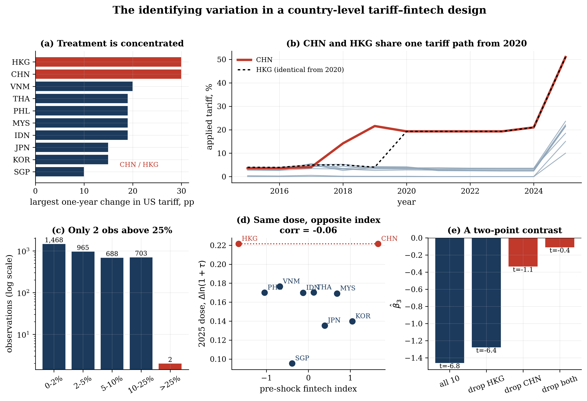

# Fintech and Trade Resilience under Targeted Tariff Shocks

**Identification diagnostics for country-level moderators — East Asia, 2015–2025**

Replication code for the paper:

> *Can Fintech Build Trade Resilience Under Tariff Shocks? Identification Diagnostics from East Asian Economies, 2015–2025.*
> Accepted for presentation at the International Symposium on Governance, Society, and Resilience: Critical Reflections from East Asia (NTU College of Social Sciences × HSUHK Graduate School), 2026.

---

## Summary

The paper asks whether financial-technology (fintech) development buffers bilateral trade against tariff shocks, using the two waves of United States tariff action (2018–2019 and 2025) as quasi-experiments. It estimates an augmented structural gravity equation by Poisson pseudo-maximum likelihood (PPML) with dyad, exporter–year and importer–year fixed effects on a panel of nine East Asian exporters, 44 destination markets and eleven years.

The answer is a finding about **measurement**, not about fintech. Within this window almost all tariff variation comes from one exporter, so any interaction with a country-level moderator is a comparison between the targeted economy and an average of the others. The repository makes that statement quantitative:

- **N_eff**, the effective number of identifying units: the inverse Herfindahl index of each unit's share of the residualised interaction regressor. A one-line diagnostic that can be reported next to the cluster count for any unit-level moderator interacted with a policy shock.
- **Elasticity decomposition**, showing that the headline tariff elasticity is the treated exporter's implied elasticity, not a panel average.
- **Randomization inference, cluster jackknife and leave-one-out deletion**, which overturn conventionally significant interactions.
- **A minimum-detectable-effect calculation** that converts the null into a design requirement, and three sector- or dyad-level designs that meet it.

## Headline results (paper)

| Quantity | Estimate |
|---|---|
| Tariff elasticity of exports, PPML three-way FE | −2.60 (s.e. 0.376) |
| Implied elasticity for the treated exporter, β₁ + β₃F_CHN = −1.332 + (−0.855)(1.664) | −2.75 (sample mean: −1.49) |
| Effective identifying units, N_eff | **4.43** against 9 exporters and 326 dyad clusters (China 39% of leverage) |
| H1 interaction: t (dyad-clustered) → t (cluster jackknife) | −3.23 → −0.90 |
| H1 randomization-inference p-value | 0.20 |
| H1 with China deleted | sign reverses (+0.632) |
| Specification curve (80 specifications) | 1 positive-significant, 49 negative-significant, 30 null |
| Minimum detectable effect, 80% power | 3.148 |
| Required multiple of effective units for a 15–25% offset | 15–43× (139–385 units) |
| Synthetic control, treated exporter's US-bound exports | shortfall ≈ 18% (2019) widening to ≈ 41% (2023) |
| Payment-corridor event study | no pre-trend (k = −3, −2: t = −0.17, −0.16) |

Full definitions are in [`docs/METHODOLOGY.md`](docs/METHODOLOGY.md).

<p align="center">
  
</p>

## Repository structure

```
.
├── src/ftres/                 analysis package
│   ├── config.py              paths, sample rules, estimation constants
│   ├── data.py                panel preparation, integrity checks, samples
│   ├── diagnostics.py         N_eff, elasticity decomposition, stepwise deletion, splice test
│   ├── inference.py           randomization inference, MDE and power table
│   ├── hypotheses.py          gravity benchmarks, dose-response, H1–H3 with fragility
│   ├── synth.py               synthetic control and in-space placebos
│   ├── corridors.py           payment-corridor event study (Route A), bilateral design (Route B)
│   ├── sector.py              sector-level design and loaders (Routes C/D)
│   ├── spec_curve.py          specification curve
│   ├── plots.py, style.py     figures
│   ├── report.py              results summary
│   └── synthetic.py           synthetic panel with the production schema
├── scripts/
│   ├── run_pipeline.py        end-to-end analysis (CLI)
│   └── make_synthetic_panel.py
├── tests/test_core.py         unit tests pinning the paper's arithmetic; integration tests
├── data/                      see data/README.md
├── results/figures/           the eight figures in the paper
├── results/tables/            result tables behind every number in the paper
├── docs/METHODOLOGY.md        estimators and diagnostics
└── paper/                     abstract and citation
```

## Quick start

```bash
git clone https://github.com/<user>/fintech-trade-resilience.git
cd fintech-trade-resilience
python -m venv .venv && source .venv/bin/activate
pip install -e ".[dev]"

pytest                                    # 11 tests, ~5 seconds

# Demo on synthetic data (no downloads needed)
python scripts/make_synthetic_panel.py
python scripts/run_pipeline.py --panel data/processed/panel_synthetic.parquet --out demo_output --n-ri 50

# Paper results (requires the processed panel in data/processed/)
python scripts/run_pipeline.py --n-ri 5000
```

`--skip-ri` runs everything except randomization inference and uses the permutation-null standard deviation recorded in the paper for the power table. Outputs are written to `results/tables/`, `results/figures/` and `results/REPORT.md`.

The synthetic panel reproduces the *structure* of the problem (one heavily targeted exporter) and therefore the qualitative diagnostics; its point estimates are not the paper's.

## From paper to code

| Paper element | Function | Output |
|---|---|---|
| Integrity checks (§III-C) | `data.splice_check`, `data.balance_check`, `diagnostics.splice_level_shift` | `tab0_*.csv` |
| Table I, identifying variation | `diagnostics.variation_by_exporter` | `tabA1_variation_by_exporter.csv` |
| Table II, stepwise deletion | `diagnostics.stepwise_deletion` | `tabA2_core_battery_by_sample.csv` |
| N_eff (§V-B) | `diagnostics.effective_units` | `tabA5_neff_shares.csv` |
| Elasticity decomposition (§VI-B) | `diagnostics.elasticity_decomposition` | `tabA6_elasticity_decomposition.csv` |
| Dose-response, Fig. 3 | `hypotheses.dose_response` | `tabA3_tariff_bins.csv` |
| Gravity benchmarks | `hypotheses.gravity_ladder` | `tabB1_gravity_ladder.csv` |
| Table III, hypotheses with fragility | `hypotheses.hypothesis_table` | `tabB2_hypotheses_with_fragility.csv` |
| Randomization inference | `inference.ri_interaction`, `inference.ri_triple` | `tabB3_ri.json` |
| Table IV, power | `inference.power_table` | `tabA4_power.csv` |
| Synthetic control, Fig. 6 | `synth.synthetic_control` | `tabB4_synthetic_control_china.csv` |
| Payment corridors, Fig. 8 | `corridors.corridor_effects`, `corridors.event_study` | `tabC1–C3_*.csv` |
| Specification curve, Fig. 5 | `spec_curve.specification_curve` | `tabD1_specification_curve.csv` |

## Data

The analysis starts from a processed dyadic panel (4,840 rows: 10 exporters × 44 destinations × 11 years) built from CEPII BACI, UN Comtrade, WITS TRAINS, the World Bank Global Findex and Worldwide Governance Indicators, the BIS fintech and big-tech credit database, and CEPII Gravity. Sources, variable definitions, hand-coded inputs and licensing are documented in [`data/README.md`](data/README.md).

## Limitations

- Several inputs are hand-coded (Section 301 effective rates after 2019, the 2025 schedule, a few 2024–25 bilateral totals, payment-corridor launch years) and flagged in the panel. `sector.effective_tariff_from_dataweb` implements the administrative replacement (calculated duties ÷ customs value, fixed 2017 weights).
- The 2025 measures were imposed under emergency economic powers and later held unlawful by the US Supreme Court (February 2026); no identified result rests on the second wave.
- The reported randomization inference uses 300 permutations; `--n-ri 5000` or more is recommended.
- The corridor matrix pools retail and wholesale payment infrastructure; `corridors.add_corridor` builds both split indicators.

## Citation

See [`CITATION.cff`](CITATION.cff) and [`paper/README.md`](paper/README.md).

## License

Code: MIT (see [`LICENSE`](LICENSE)). Data remain subject to the terms of their original providers.
